# 🕹️ Web Arcade

A GitOps-driven, multi-branch game archive and deployment system designed for browser-based games. Each game exists on its own orphan branch, containing all related frontend assets and configurations. The `main` branch orchestrates everything—build logic, Dockerfile, deployment workflows—using PHP, Shell scripts, and Docker. Deployments are handled via [Komodo](https://komo.do/docs/intro) in a fully automated pipeline.

---

## 📑 Table of Contents

- [Project Overview](#project-overview)
- [Requirements](#requirements)
- [Repository Structure](#repository-structure)
- [Branching Strategy](#branching-strategy)
- [CI/CD Workflow](#cicd-workflow)
- [Why PHP?](#why-php)
- [FAQ / Notes / Troubleshooting](#faq--notes--troubleshooting)

---

## 📖 Project Overview

This repository powers a web-based arcade. Each game lives in a **dedicated orphan branch**, while the `main` branch manages build orchestration and deployment via Komodo. Assets are static—HTML, JS, CSS—and served from a Docker container with Apache. The system is built to scale cleanly, minimize runtime logic, and deploy across multiple architectures.

---

## 💻 Requirements

The following tools are required to run or contribute to this repository:

| Tool   | Use Case                     | Link                                      |
| ------ | ---------------------------- | ----------------------------------------- |
| Docker | Build & run containers       | [Get Docker](https://docs.docker.com/)    |
| Komodo | GitOps Deployment Engine     | [Komodo Docs](https://komo.do/docs/intro) |
| Git    | Version control & branching  | [Git](https://git-scm.com/)               |
| PHP    | Used for build orchestration | [PHP](https://www.php.net/)               |
| Shell  | Scripts and build logic      | Built-in on Unix-based systems            |

---

## 📂 Repository Structure

| Path          | Purpose                                                                                       |
| ------------- | --------------------------------------------------------------------------------------------- |
| `/maker`      | Contains `build.php`, the script that fetches all orphan branches and builds a unified index. |
| `/scripts`    | Includes deployment and helper bash scripts.                                                  |
| `/cloud/`     | Temporary directory during build—contains processed assets.                                   |
| `/Dockerfile` | Multi-stage build for preparing and serving the arcade app.                                   |
| `/index.html` | Generated output after building; links to each game branch dynamically.                       |

---

## 🌿 Branching Strategy

Each game exists in its **own orphan branch**, enabling complete isolation of assets and logic. For example:

| Branch Name          | Description                                    |
| -------------------- | ---------------------------------------------- |
| `Alien-Invasion`     | Standalone game branch with HTML/CSS/JS/assets |
| `Fruit-Ninja2`       | Another game with full offline support         |
| `Ballistic-Chickens` | A game currently not mobile compatible         |
| `JumpJellyJump`      | Game in progress, requires cache optimization  |

The `main` branch builds a global index and generates a single Docker image serving all active games via Apache.

---

## ⚙️ CI/CD Workflow

### 🔄 Current Workflow

```mermaid
flowchart TD
  %% --- Developer Section ---
  subgraph DEV["👨‍💻 Developer Actions"]
    direction TB
    Dev[Developer]
    Dev --> GameBranches["Push to Orphan Branches"]
    Dev --> MainBranch["Push to Main Branch"]
    Dev --> GitTag["Create Git Tag<br>(vX.Y.Z)"]
  end

  %% --- Git Repository ---
  subgraph GIT["📁 Git Repository"]
    direction TB
    GameBranches --> GitRepo1["Game Code"]
    MainBranch --> GitRepo2["Dockerfile, Compose, Scripts"]
    GitTag --> GitRepo3["Release Metadata"]
  end

  Dev --> GIT

  %% --- CI/CD Trigger ---
  subgraph KOMODO_TRIGGER["🚀 CI/CD Trigger"]
    direction TB
    GitTag --> KomodoWebhook["📦 Webhook Trigger"]
  end

  %% --- Build & Test Pipeline ---
  subgraph KOMODO_BUILD["🔧 Komodo CI Builder"]
    direction TB
    KomodoWebhook --> DockerMultiarchBuild["🔨 Build Multiarch Docker Image<br>(arm64 + amd64)<br>↳ Clone Repo<br>↳ apk add git<br>↳ Run build.php install<br>↳ Cleanup & Reorganize Files"]
    DockerMultiarchBuild --> RunTests["🧪 Run Integration Tests"]
    RunTests --> PushToRegistry["📤 Push to Container Registry"]
    RunTests --> NotifyFailBuild["🚨 Notify Build Failure"]
  end

  %% --- Container Registry & Image Monitoring ---
  subgraph REGISTRY["📦 Container Registry"]
    direction TB
    PushToRegistry --> DockerHub["DockerHub / Private Registry"]
    DockerHub --> RenovateBot["🤖 Renovate Bot"]
    RenovateBot --> DeployWebhook["📡 Webhook: New Image Available"]
  end

  %% --- Production Deployment ---
  subgraph PROD_SERVER["🖥️ Production Server"]
    direction TB
    DeployWebhook --> PullLatestImage["⬇️ Pull Latest Image"]
    PullLatestImage --> StopOldContainer["⛔ Stop & Remove Old Container"]
    StopOldContainer --> RunNewContainer["▶️ Run New Container<br>(Web Arcade)"]
    RunNewContainer --> HealthCheck["🔍 Service Health Check"]
    HealthCheck --> NotifySuccess["✅ Notify Deployment Success"]
    HealthCheck --> Rollback["↩️ Rollback & Notify Failure"]
  end

  %% --- Access & Security ---
  subgraph SECURITY["🛡️ Access & Security"]
    direction TB
    PUB["Public Access Gateway"] --> FW["UFW (Firewall)"]
    FW --> P1["Reverse Proxy (NGINX / Traefik)"]
    P1 --> RunNewContainer
  end

  %% --- External Users ---
  subgraph EXTERNAL["🌐 External User"]
    direction TB
    User["User Request"]
    User --> WAF["Cloudflare WAF"]
    WAF -->|Blocked| Blocked["🚫 Request Blocked"]
    WAF -->|Allowed| PUB
  end

  %% --- Notification System ---
  subgraph NOTIFY["🔔 Notification System"]
    direction TB
    NotifyFailBuild --> TelegramBot["📬 Telegram Bot"]
    NotifySuccess --> TelegramBot
    Rollback --> TelegramBot
    TelegramBot --> Dev
  end

  %% --- Styling ---
  classDef dev fill:#a3d8f4,stroke:#036,stroke-width:1.5px,color:#000;
  classDef git fill:#c9f0ff,stroke:#036,stroke-width:1.5px,color:#000;
  classDef komodo fill:#f9f,stroke:#b06,stroke-width:1.5px,color:#000;
  classDef registry fill:#ffd3d3,stroke:#a00,stroke-width:1.5px,color:#000;
  classDef prod fill:#d7f4d7,stroke:#060,stroke-width:1.5px,color:#000;
  classDef notify fill:#f0e68c,stroke:#a70,stroke-width:1.5px,color:#000;
  classDef sec fill:#e0e0ff,stroke:#00a,stroke-width:1.5px,color:#000;
  classDef user fill:#fef6d9,stroke:#8a6d3b,stroke-width:2px,color:#000;

  class Dev dev
  class GameBranches,MainBranch,GitTag,GitRepo1,GitRepo2,GitRepo3 git
  class KomodoWebhook,DockerMultiarchBuild,RunTests,PushToRegistry komodo
  class NotifyFailBuild,NotifySuccess,Rollback,TelegramBot notify
  class DockerHub,RenovateBot,DeployWebhook registry
  class PullLatestImage,StopOldContainer,RunNewContainer,HealthCheck prod
  class PUB,FW,P1 sec
  class User,WAF,Blocked user

```

<!-- Current Workflow -->

Komodo-Based Diagram

- Git tags trigger Komodo webhooks.
- Komodo builds the Docker image using a defined builder.
- The image is pushed to a container registry.
- A post-push webhook triggers a new deployment.
- Komodo updates the running container on the target server.

### 🧾 Legacy Workflows

<!-- Legacy Workflow -->

Jenkins-Based Diagram

**Why it was replaced**:

- Jenkins workflow was **slow** and **resource-heavy**
- CircleCI was faster but **fully cloud-based**, and relied on complex bash scripts
- Komodo provided a lightweight, self-hosted, declarative GitOps alternative

---

## ❓ Why PHP?

PHP powers the build logic. Specifically:

- `build.php` clones all orphan branches.
- Generates a **unified `index.html`** that dynamically links to all games.
- Acts as a local static site generator before Docker packaging.

This lightweight approach avoids runtime server logic, keeping deployments minimal.

---

## 🛠️ FAQ / Notes / Troubleshooting

### 💬 Common Questions

**Q: Why use orphan branches instead of folders?**  
A: Orphan branches keep each game’s history isolated and allow independent versioning. It also keeps the `main` branch lightweight.

**Q: Can I use this without Komodo?**  
A: Yes. You can run the `build.php` manually and use `docker build` and `docker run` to serve the content.

---
**THIS REPOSITORY IS ENCRYPTED. IF YOU'RE HERE, YOU'RE EITHER VERY BRAVE OR VERY LOST. EITHER WAY, GOOD LUCK!**
